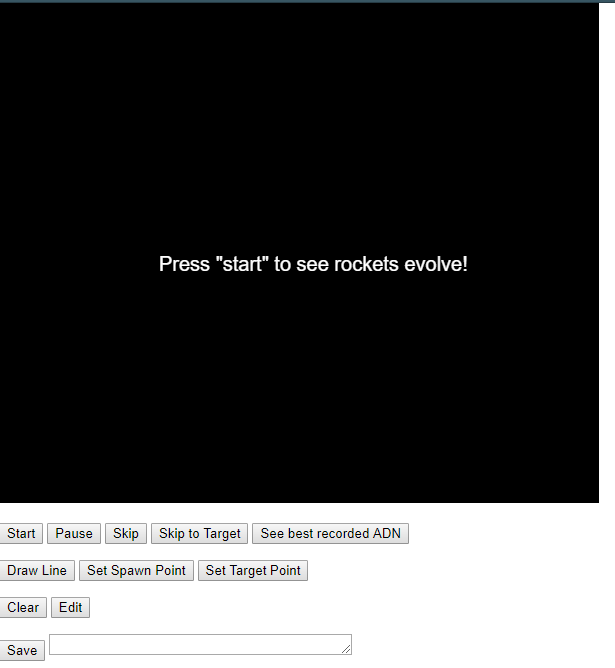
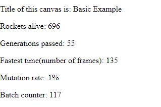
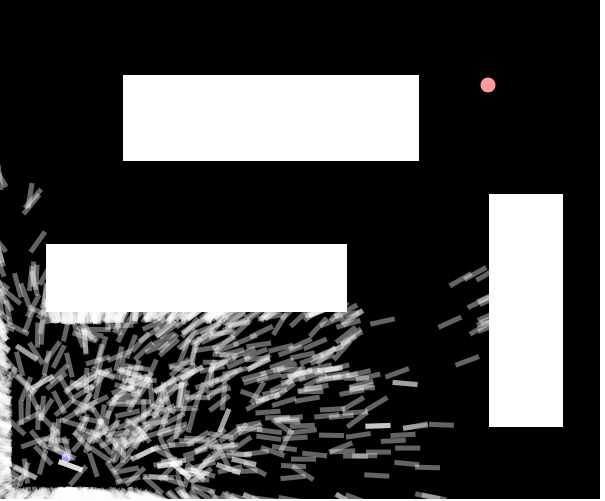
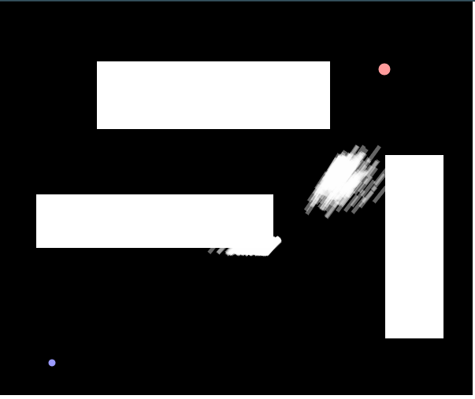

# Smart Rockets Evolved

This project implements an app that allows the user to study the way a genetic algorithm evolves in time. 

The rockets try to find the fastest way towards the target. Every cell(rocket) has its own DNA(a series of movement commands). 

When the lifespan of a generation ends, or every rocket either hit an obstacle or the target, the performance of each individual rocket is evaluated. The rockets that were able to get closer to the target, or got to the target faster receive a greater fitness value and this makes them more likely to be selected as a parent cell for the creation of the next generation. The DNA of the next generation is built with crossover functions and random mutations.

The code presented here uses the codebase presented in the Smart Rockets Coding challenge (https://www.youtube.com/watch?v=bGz7mv2vD6g) and expands upon it.
 
## Usage

The buttons that can be observed on the initial page do the following:

- “Start”: Starts the simulation. If the page is opened for the first time, a basic example containing a spawning point and a target will be displayed.

- “Pause”: Pauses the simulation.

- “Skip”: skips the display of 50 generations, but the population evolves in the background.

- “Skip to target”: Skips until the target is found by one rocket. Skipping makes finding a path faster, since the process is bottlenecked by the frames per second.

- “Clear”: Clears the course(coordinates for spawn, target and walls) and the population.

- “Edit”: Begins edit mode, where you can change the coordinates of the spawn point and the target. This is done with the “Set Spawn Point” and “Set Target Point” buttons. The “Draw Line button  adds walls(the first click will set one corner of a rectangle, the second click sets the opposite corner and saves the wall).

- “Save”: Saves the course into a cloud database (Firebase). A name needs to be written in the field next to the save button. WARNING: feature disabled as firebase database was deleted.

## Status information

## Evolution

Example of simulation at the start: the rockets move randomly:

After evolving:

